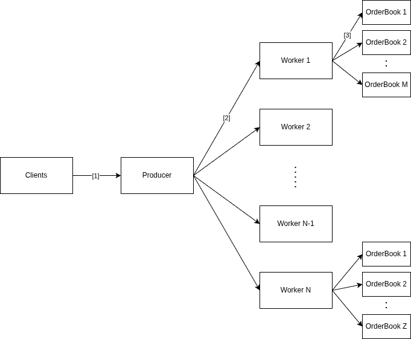

# A C++ Implementation of the OrderBook Engine
A high-performance, lock-free order book engine written in C++. This implementation uses a multi-threaded architecture with lock-free queues to efficiently handle order matching and execution with minimal contention.

## Features
- Lock-free Architecture: Single-producer single-consumer (SPSC) queues with atomic operations for zero-lock performance
- Symbol-based Routing: Orders automatically routed to dedicated workers based on symbol
- Multi-threaded Processing: Each symbol processed by independent workers to maximize parallelism
- Comprehensive Testing: Full test suite using GoogleTest framework
- High Performance: Optimized for low-latency order processing

## Requirements
- C++23 
- CMake 3.20+
- vcpkg package manager
- GoogleTest (installed via vcpkg)
- Boost (installed via vcpkg)

## Installation
1. Install Dependencies
bash./vcpkg install gtest
2. Build the Project <br>
    a) Navigate to the project directory and create a build folder:
    ```bash
    ~/Documents/cpp-orderbook
    mkdir build
    cd build
    ```
    b) Configure and build with CMake (specify cmake directory):
    ```bash
    cmake .. -DCMAKE_TOOLCHAIN_FILE=~/Documents/vcpkg/scripts/buildsystems/vcpkg.cmake -DCMAKE_BUILD_TYPE=Release
    cmake --build .
    ```

## Running Tests
Execute the test suite:
``` bash
cd build
./tests/all_tests
```

## Performance
To enable performance measurements with perf, configure kernel settings:
``` bash
sudo sysctl -w kernel.perf_event_paranoid=-1
```
System specification:
- CPU: 12th Gen Intel(R) Core(TM) i5-12400F (6 cores, 12 threads)
- RAM: 16GB, 3200 MT/S

Then run benchmarks (in build folder).
```bash
./src/bench_insert_s
./src/bench_insert_m
./src/bench_match20_s
./src/bench_match20_m
```
| Benchmark       |                     Configuration               | Time   | Throughput
| --------------- | ----------------------------------------------- | ------ | ----------
| bench_insert_s  | 1M orders, 5 symbols, 1 thread (no matching)    | 0.074s | 13.5M orders/sec
| bench_insert_m  | 1M orders, 5 symbols, 5 threads (no matching)   | 0.035s | 28.5M orders/sec
| bench_match20_s | 1M orders, 5 symbols, 1 thread (20% match rate) | 0.097s | 10.3M orders/sec
| bench_match20_m | 1M orders, 5 symbols, 5 thread (20% match rate) | 0.039s | 25.6M orders/sec

## Key Observations:
- Multi-threaded execution achieves ~2.1x speedup on insertion workloads
- Matching operations add ~30% latency due to additional processing
- Lock-free architecture scales efficiently with thread count

### Scalability Analysis
The ~2.1x speedup with 5 threads (vs theoretical 5x) is lower than expected. Despite extensive investigation and optimization, the exact bottleneck remains unclear.

Optimizations already applied:
- Data structure padding to eliminate false sharing
- Memory alignment for cache line boundaries
- Pre-allocated space to avoid dynamic allocations

### Remaining investigation needed:
The bottleneck is not the producer stage and appears to be within the worker/order book processing pipeline. Potential areas include lock-free queue semantics, memory bandwidth saturation, or fundamental algorithmic constraints that haven't yet been identified. This remains an open question for future investigation.

## Architecture



## Design Overview
The order book engine uses a producer-consumer pattern with symbol-based order routing: <br>
<b> Order Flow: </b>
1) Client submits an order to the Producer <br>
2) Producer hashes the symbol and routes the order to the appropriate Worker <br>
3) Worker receives the order via a lock-free SPSC queue <br>
    a) Each worker maintains atomic head/tail pointers for maximum efficiency <br>
    b) Eliminates lock contention by serializing symbol processing
4) Worker distributes the order to the corresponding OrderBook for matching

## Key Components
- Producer: Entry point that routes orders to workers based on symbol
- Worker Pool: Multiple workers, each handling one or more symbols
- SPSC Queue: Lock-free queue using atomic operations for thread-safe communication
- OrderBook: Maintains buy/sell order books and executes matches for a specific symbol

## Concurrency Model
- Each symbol is assigned to exactly one worker (no locking required within a symbol)
- SPSC queues use atomic compare-and-swap (CAS) operations for synchronization
- Multiple symbols can be processed in parallel by different workers 
- Minimal context switching and cache coherency overhead